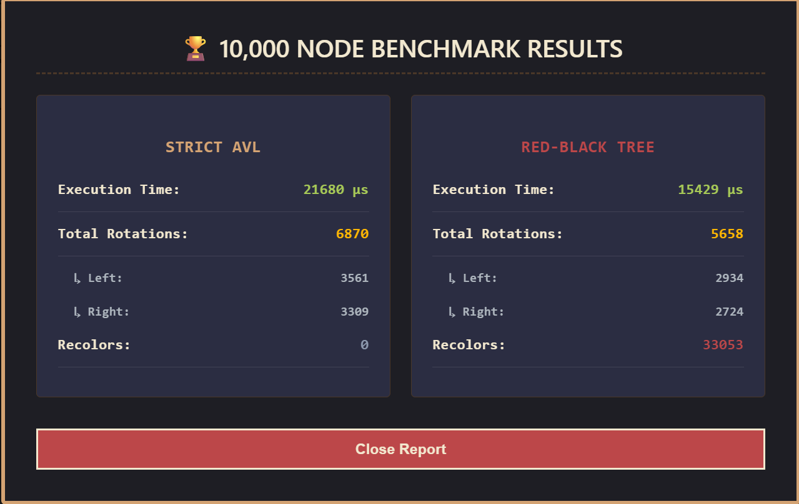
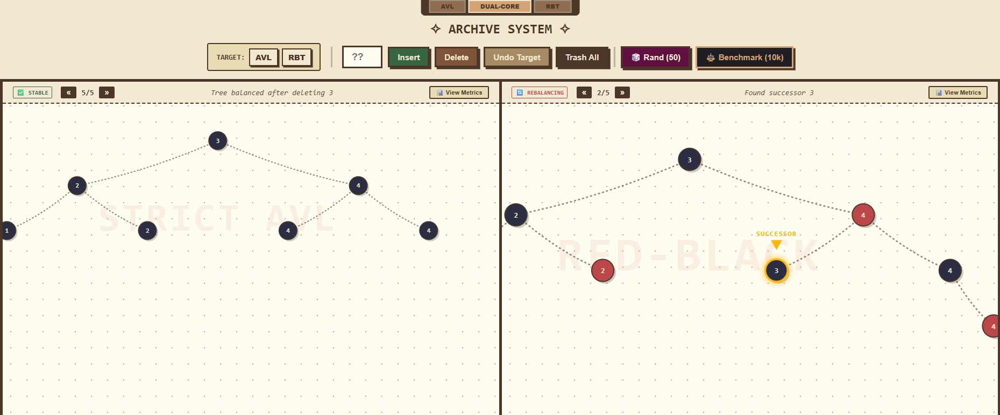

<div align="center">

# 🌳 AVL vs Red-Black Tree: Dual-Engine Visualizer

### A performance benchmarking and visualization tool for comparing AVL and Red-Black tree balancing strategies

[](https://isocpp.org/)
[](https://www.python.org/)
[](https://fastapi.tiangolo.com/)
[](https://react.dev/)
[](https://vitejs.dev/)
[](https://opensource.org/licenses/MIT)

**Built with stateless C++ engines and a real-time React interface**



</div>

---

## 💡 Why This Exists

Self-balancing binary search trees solve the same problem—maintaining O(log n) operations—but make different trade-offs. AVL trees enforce stricter balance constraints (height difference ≤ 1), while Red-Black trees use a color-coding scheme with relaxed balancing rules. This project quantifies those trade-offs with microsecond-precision telemetry and provides step-by-step visualization of every rotation and recolor.

---

## 📊 Benchmark Results (10,000 Random Insertions)

<div align="center">

| Metric | AVL Tree | Red-Black Tree | Difference |
|--------|----------|----------------|------------|
| **⚡ Execution Time** | 21,680 µs | 15,429 µs | **AVL 40% slower** |
| **🔄 Total Rotations** | 6,870 | 5,658 | AVL rotates 21% more |
| **↪️ Left Rotations** | 3,561 | 2,934 | - |
| **↩️ Right Rotations** | 3,309 | 2,724 | - |
| **🎨 Recolors** | 0 | 33,053 | RBT trades rotations for recolors |

</div>

> **🔍 Key Observation:** Red-Black trees complete 10,000 insertions 6.2 milliseconds faster by performing 1,212 fewer rotations. They compensate with 33,053 color flips, which are O(1) pointer operations versus O(1) structural rotations. On this hardware, recoloring is cheaper than rotating.

---

## 🚀 What You Can Do With This

### 1️⃣ Native Hardware Benchmarks

Clicking the **Benchmark (10k)** button in the React UI triggers a special API route that executes the engines with a `B10000` flag:

```bash
./avl B10000   # Bypasses snapshot captures, loops 10k inserts natively
```

The C++ engine intercepts this command, disables the expensive deep-copy SVG frame generation, and runs a pure native memory loop. It serializes only the final telemetry counters (rotations, recolors, microseconds) back to the UI, providing noise-free algorithmic benchmarking without crashing the browser's DOM.

The engines compile operation history, execute purely in C++, and return:
- ⏱️ Microsecond execution time
- 🔄 Rotation counts (left/right split)
- 🎨 Recolor counts (RBT only)

### 2️⃣ Step Through Balancing Operations

Watch how each tree rebalances after a single insertion or deletion:

* **⚡ Instant Completion with Time-Travel Rewind**: Operations instantly snap to the final balanced tree state to maximize perceived system performance. Users can then use the `«` and `»` playback controls to step backward through time and scrub through the exact rebalancing history frame-by-frame.

* **🎯 Granular Node Highlighting**: Dynamic visual indicators highlight specific node states. The engine visually isolates unbalanced nodes, marks physical memory rotation pivots, and uses a dedicated drop-down arrow indicator to pinpoint the exact path of an Inorder Successor during deletion.

* **📈 Live Microsecond-Precision Telemetry Overlay**: A hidden diagnostics panel can be toggled via the "📊 View Metrics" button. It pulls live, cumulative C++ execution data directly from the backend, mapping out microsecond execution times, exact left vs. right pointer rotation splits, and byte-level color flips per engine in real-time.

* **📝 Contextual Operation Logs**: The UI header prints custom, human-readable strings compiled by the C++ engine (e.g., *"Left-Right Imbalance detected at node 45. Preparing double rotation..."*) that update dynamically as you scrub through frames.

<div align="center">

</div>

---

## 🏗️ Architecture

### ⚙️ Stateless C++ Engines

Both `avl_tree.cpp` and `red_black_tree.cpp` hold zero memory between requests. The React frontend sends operation history as command-line arguments:

```bash
./avl i10 i20 i30 d20 i25
```

The engine:
1. Fast-forwards through `i10 i20 i30 d20` without capturing frames
2. Captures frame-by-frame animation for the final operation `i25`
3. Outputs JSON with animation frames and telemetry
4. Exits (no daemon, no state persistence)

This design enables:
- **↩️ Instant undo/redo**: Rebuild tree state from history array
- **🎬 Deterministic replay**: Same input history = identical output frames
- **⚡ Parallel execution**: AVL and RBT engines run simultaneously via FastAPI

### 📸 Frame Capture System

During the final operation, the engine takes deep-copy snapshots of the tree at each rebalancing step:

```cpp
void captureSnapshot(string op, string desc, node* root, node* highlight1, node* highlight2) {
    SnapshotFrame frame;
    frame.step_id = current_step_id++;
    frame.operation_type = op;  // "AVL_UNBAL", "RBT_RECOLOR", etc.
    frame.action_description = desc;
    frame.root_snapshot = deepCopy(root);  // Full tree copy
    // Mark highlighted nodes (pivot, parent, uncle, etc.)
    animation_frames.push_back(frame);
}
```

Each frame includes:
- 🌲 Complete tree structure (node IDs, values, colors, parent/child pointers)
- 🎯 Highlighted nodes with role labels (PIVOT, IMBALANCED, SUCCESSOR)
- 📝 Human-readable description ("Right rotation around node 50")

### 🛠️ Tech Stack

<div align="center">


</div>

- **C++17**: AVL/RBT implementations with `nlohmann/json` serialization
- **Python FastAPI**: HTTP router between React and C++ subprocesses
- **React 18 + Vite**: SVG-based tree renderer with zoom/pan/step controls
- **No external BST libraries**: All rotation logic, recoloring, and parent-pointer management written from scratch

---

## 📁 Project Structure

```
DUAL-CORE-ENGINE/            
│
├── .gitignore                
├── README.md                 
├── api.py                    <-- Python FastAPI middleware routing layer
├── avl_tree.cpp              <-- Custom AVL logic with hardware telemetry counters
├── red_black_tree.cpp        <-- Custom RBT logic with NIL sentinel nodes
├── json.hpp                  <-- nlohmann/json header-only library
│
├── docs/                     <-- Documentation assets
│   └── benchmark-results.png <-- Screenshot of 10k benchmark modal
│
└── rbt-frontend/             <-- React + Vite frontend application
    ├── index.html
    ├── package.json
    ├── vite.config.js
    └── src/
        ├── App.jsx           <-- The interactive dashboard
        ├── main.jsx
        └── index.css         <-- Strict 100% edge-to-edge canvas reset
```

---

## 🔧 How to Build and Run

### 📋 Prerequisites


- **C++ Compiler**: g++ or clang with C++17 support
- **Python 3.8+**: For FastAPI server
- **Node.js 18+**: For React frontend

### 🔨 Compile Engines

```bash
g++ -std=c++17 -O2 avl_tree.cpp -o avl
g++ -std=c++17 -O2 red_black_tree.cpp -o rbt
```

### 🚀 Start API Server

```bash
pip install fastapi uvicorn
uvicorn api:app --reload --host 127.0.0.1 --port 8000
```

### 🎨 Launch Frontend

```bash
cd frontend
npm install
npm run dev
```

Navigate to `http://localhost:5173`

---

## 🎮 Feature Breakdown

### 🕹️ Interactive Controls

- **🎯 Target Toggle**: Run operations on AVL only, RBT only, or both simultaneously
- **➕ Insert/Delete**: Send integer values to engines
- **↩️ Undo**: Rewind operation history and rebuild tree state
- **🗑️ Trash All**: Clear both trees and reset metrics
- **🎲 Rand (50)**: Stress test with 50 random insertions

### 👁️ Visualization Features

- **📊 Split View**: Compare AVL and RBT side-by-side during same operation
- **🖼️ Single View**: Focus on one engine in fullscreen
- **🔍 Zoom/Pan**: Mouse wheel to zoom, click-drag to pan canvas
- **⏯️ Frame Stepping**: `«` and `»` buttons to scrub through animation frames
- **📈 Telemetry Overlay**: Click "View Metrics" to see rotation/recolor counts and execution time

### ⚡ Benchmark Mode

Click **Benchmark (10k)** to run native C++ insertion of 10,000 random nodes. Both engines execute in parallel with animation capture disabled. Results show cumulative metrics since program start (not just the benchmark phase).

---

## 🔬 Implementation Details

### ⚛️ React DOM Reconciliation: The "Identity Theft" Trick

Standard BST deletion destroys the successor node and updates the root's value, which breaks React's `framer-motion` / SVG transition animations. To solve this, the C++ backend utilizes an "Identity Theft" pointer swap during deletion:

```cpp
root->data = temp->data; 
root->id = temp->id;
```

By swapping the actual unique string `id` of the nodes, React's virtual DOM is tricked into physically gliding the successor node up the SVG canvas to replace the deleted node, resulting in a flawless frontend animation driven purely by backend pointer manipulation.

### 🌲 AVL Balancing

After each insertion/deletion, recalculate balance factors:

```cpp
int balance = height(node->left) - height(node->right);
```

Four imbalance cases trigger rotations:
- **↪️ Left-Left** (balance > 1, left-heavy): Single right rotation
- **↩️ Right-Right** (balance < -1, right-heavy): Single left rotation  
- **↪️↩️ Left-Right** (balance > 1, but left child is right-heavy): Left rotation on child, then right rotation on parent
- **↩️↪️ Right-Left** (balance < -1, but right child is left-heavy): Right rotation on child, then left rotation on parent

Height is updated after every rotation:

```cpp
node->height = 1 + max(height(node->left), height(node->right));
```

### 🔴⚫ Red-Black Balancing

After insertion, a new node is colored RED. If parent is also RED, fix violation:

**🎨 Case 1: Uncle is RED**
- Recolor parent and uncle to BLACK
- Recolor grandparent to RED
- Move up the tree and repeat

**🔄 Case 2: Uncle is BLACK (line configuration)**
- Rotate grandparent
- Swap colors of parent and grandparent

**🔄 Case 3: Uncle is BLACK (zig-zag configuration)**
- Rotate parent to create line configuration
- Apply Case 2

Deletion uses a similar fixup process with four mirror cases. The implementation uses a `NIL` sentinel node instead of null pointers:

```cpp
node* node::NIL = new node();  // Single shared sentinel
```

This eliminates null checks and simplifies parent-pointer logic.

---

## ⚖️ Trade-offs Observed

<div align="center">

### 🌳 AVL Trees


</div>

- ✅ Stricter balance (max height difference = 1) → faster lookups
- ❌ More rotations during modifications (6,870 rotations for 10k insertions)
- ❌ Slower insertion time (21,680 µs vs 15,429 µs for RBT)
- **💼 Use Case:** Read-heavy workloads (databases, in-memory caches)

<div align="center">

### 🔴⚫ Red-Black Trees


</div>

- ✅ Fewer rotations (5,658 for 10k insertions)
- ✅ Faster insertion/deletion (28% faster than AVL in benchmark)
- ✅ Recoloring is cheaper than rotating (33,053 recolors executed quickly)
- ❌ Looser balance constraints (black-height property, not strict height balance)
- **💼 Use Case:** Write-heavy workloads (Linux kernel scheduler, Java `TreeMap`)

---

## 🛠️ What Was Built From Scratch

1. **🌲 AVL insert/delete with height tracking**: Manual balance factor calculation, four-case rotation logic
2. **🔴⚫ RBT insert/delete with safe memory bounds**: Implemented a global static `NIL` sentinel node (`node* node::NIL = new node();`) to replace raw `nullptr` checks. This guarantees safe parent-pointer color checking (e.g., `z->parent->color == 'R'`) and prevents segmentation faults during deep-tree fixups
3. **📸 Frame capture system**: Deep-copy snapshots with node highlighting and role labels
4. **📊 Telemetry counters**: Embedded rotation/recolor tracking inside C++ balancing functions
5. **💻 Stateless command-line interface**: History reconstruction from string array
6. **⚛️ React SVG renderer**: Recursive tree drawing with zoom/pan transforms
7. **🐍 FastAPI subprocess handler**: Parallel engine execution with error handling

> **🎯 No external tree libraries or visualization frameworks were used.** All pointer manipulation, parent-linking, and balancing logic is custom C++ code.

---

## ⚡ Performance Notes

Benchmark execution times include:
- 🎲 Random number generation for node values
- 📚 All historical insertions (fast-forwarded without frame capture)
- 🌳 Final tree traversal for JSON serialization
- 📊 Cumulative rotation/recolor counts across entire session

The **40% performance difference** (21,680 µs vs 15,429 µs) reflects AVL's 1,212 extra rotations. Each rotation involves:
- 🔗 Parent pointer updates (3-4 pointer writes)
- 📏 Height recalculation (recursive traversal up to root)
- 🔄 Subtree reattachment (child pointer swaps)

Red-Black recoloring is cheaper because it only writes a single `char` field and doesn't restructure the tree.

---

## 📄 License

<div align="center">

[](https://opensource.org/licenses/MIT)

**MIT License** - Feel free to use this project for learning and experimentation

</div>

---

<div align="center">

### 🎯 Built to understand the real cost of tree balancing strategies

**The numbers don't lie: on random insertion workloads, Red-Black trees win by avoiding structural rotations. AVL trees pay for their strict balance with measurably slower modification times.**

---

Made with ❤️ using C++, Python, and React

[](https://github.com)
[](https://github.com)

</div>